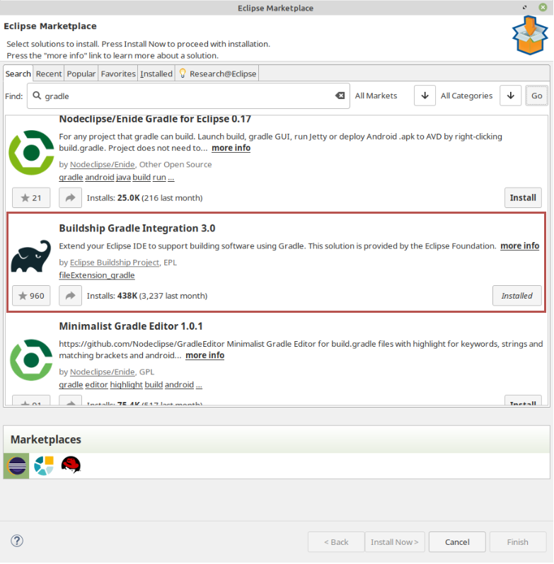
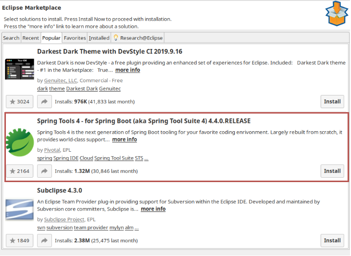

[][1]
[](https://travis-ci.org/andifalk/secure-oauth2-oidc-workshop)

# OAuth 2.0 / OpenID Connect 1.0 Workshop

Authentication and authorization for Microservices with OAuth 2.0 (OAuth2) and OpenID Connect 1.0 (OIDC).

[Presentation Slides (HTML5)](https://andifalk.github.io/secure-oauth2-oidc-workshop/)

# Hands-On Workshop

For the hands-on workshop you will extend a provided sample application:

An Online Book Library with following use cases:

* Administer Library Users
* Administer Books
* List available Books
* Borrow a Book
* Return a previously borrowed Book

The components you will use and build look like this:


To use the sample library server application please consult the 
[REST API documentation](https://andifalk.github.io/secure-oauth2-oidc-workshop/api-doc.html).

You may use the provided [Postman Collection](oidc_workshop.postman_collection.json). Just import
this collection (Version 2.1 format) into Postman.

All the code currently is build and tested against:
* Java 8, Java 9 and Java 11
* [Spring Boot 2.2.0 Release](https://spring.io/blog/2019/10/16/spring-boot-2-2-0) 
* [Spring Framework 5.2.0 Release](https://spring.io/blog/2019/09/30/spring-framework-5-2-goes-ga)
* [Spring Security 5.2.0 Release](https://spring.io/blog/2019/10/01/spring-security-5-2-goes-ga)
* [Spring Batch 4.2.0 Release](https://spring.io/blog/2019/10/02/spring-batch-4-2-in-now-ga)

## Preparation and Setup

### Requirements and useful tools

* [Java SDK](https://openjdk.java.net/install/) Version 8, 9 or 11
* A Java IDE ([Eclipse](https://www.eclipse.org/downloads/), [IntelliJ](https://www.jetbrains.com/idea/download), [VS Code](https://code.visualstudio.com/), ...)
* [Git](https://git-scm.com/)
* [Postman](https://www.getpostman.com/downloads/), [Httpie](https://httpie.org/#installation), or [Curl](https://curl.haxx.se/download.html) for REST calls

#### IntelliJ specific requirements

IntelliJ does not require any specific additional plugins or configuration.

#### Eclipse IDE specific requirements

Please make sure you have installed the _Buildship Gradle Integration_ from the eclipse marketplace.



To start spring boot applications from within Eclipse please install _"Spring Tools 4 - for Spring Boot"_ extension 
from marketplace (under 'popular' tab) or just use the eclipsed based [Spring Toolsuite 4](https://spring.io/tools) directly.



#### VS Code specific requirements

To be able to work properly in VS Code with this Spring Boot Java Gradle project you need at least these extensions:

* Java Extension Pack
* vscode-gradle-language
* VS Code Spring Boot Application Development Extension Pack

### Get the source code
                       
Clone this GitHub repository (https://github.com/andifalk/secure-oauth2-oidc-workshop):

```
git clone https://github.com/andifalk/secure-oauth2-oidc-workshop.git oidc_workshop
```

After that you can import the whole workshop project directory into your IDE as a __gradle project__:

* [IntelliJ](https://www.jetbrains.com/idea): "New project from existing sources..." and then select 'Gradle' when prompted
* [Eclipse](https://www.eclipse.org/) or [Spring ToolSuite](https://spring.io/tools): "Import/Gradle/Existing gradle project"
* [Visual Studio Code](https://code.visualstudio.com/): Just open the root directory and wait until VS Code configured the project


### Setup Keycloak
                  
1. Download 'keycloak_workshop.zip' from https://tinyurl.com/y3wjzwch (Use password: 'Workshop')
2. Extract the downloaded __keycloak_workshop.zip__ file into a new local directory of your choice 
   (this directory will be referenced as _<KEYCLOAK_INSTALL_DIR>_ in next steps)
3. To startup [Keycloak](https://keycloak.org):
    1. Open a terminal and change directory to sub directory _<KEYCLOAK_INSTALL_DIR>/bin_ and start Keycloak using 
the __standalone.sh__(Linux or Mac OS) or __standalone.bat__ (Windows) scripts
    2. Wait until keycloak has been started completely - you should see something like this `...(WildFly Core ...) started in 6902ms - Started 580 of 842 services`
    3. Now direct your browser to [localhost:8080/auth/admin](http://localhost:8080/auth/admin/)
    4. Login into the admin console using __admin/admin__ as credentials   

Now, if you see the realm _workshop_ on the left then Keycloak is ready to use it for this workshop

## Intro Labs

* [Intro Lab: Authorization Code Grant Flow in Detail](intro-labs/auth-code-demo)
* [Intro Lab: A pre-defined OAuth2 client for GitHub](intro-labs/github-client)

## Hands-On Labs

* [Lab 1: OAuth2/OIDC Resource Server](lab1)
* [Lab 2: OAuth2/OIDC Web Client (Auth Code Flow)](lab2)
* [Lab 3: OAuth2/OIDC Batch Job Client (Client-Credentials Flow)](lab3)
* [Lab 4: OAuth2/OIDC Testing Environment](lab4)

## Bonus Labs

* [Demo: OAuth2/OIDC Resource Server with Micronaut](bonus-labs/micronaut-server-app)

## License

Apache 2.0 licensed
Copyright (c) by 2019 Andreas Falk

[1]:http://www.apache.org/licenses/LICENSE-2.0.txt
