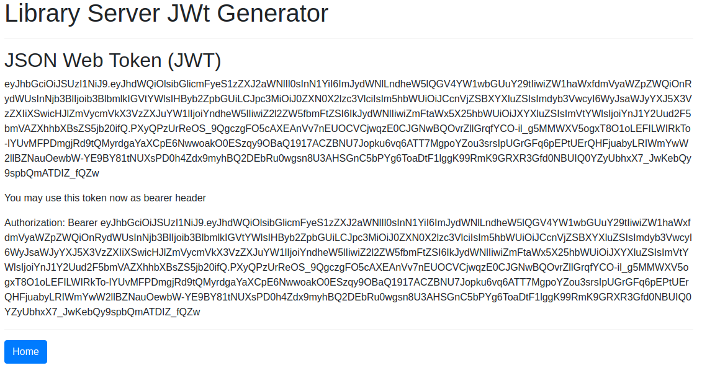
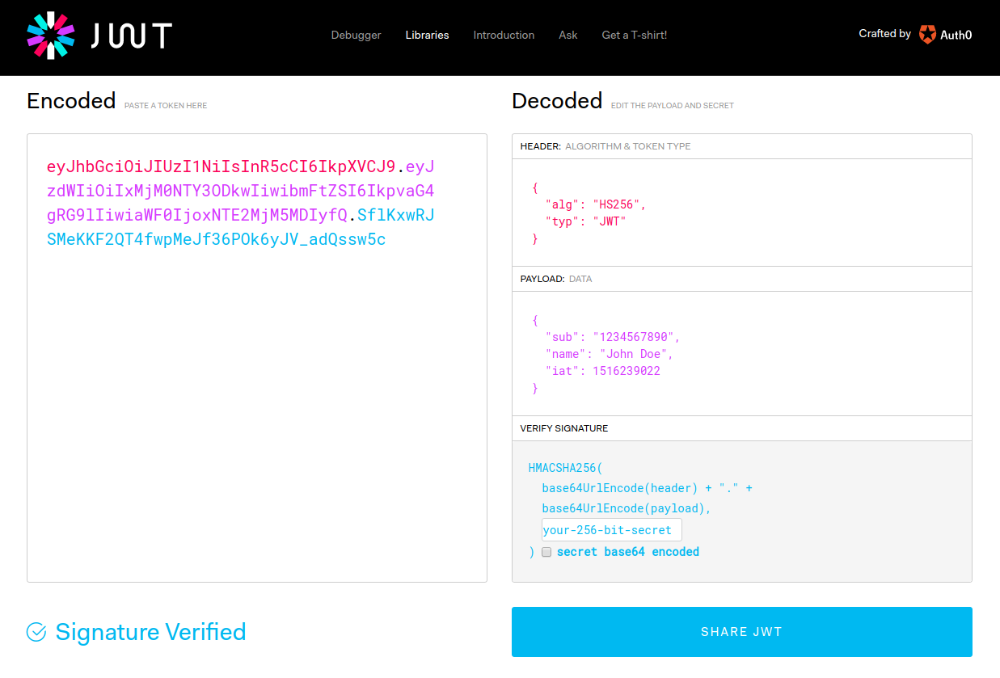

# Lab 5: Creating a Testing Environment for an OIDC Resource Server

Creating a testing environment is useful to perform

* Performance & Load Tests
* Security Tests
* Other User Acceptance tests
* ...

By using OAuth2/OIDC you have an additional external component in place that is required to
run your clients and server applications.

To support testing environments without having external dependencies you have several possibilities:

1. Spring Integration Tests for JWT (see last lab)
2. Test using your own self-signed JWT tokens
3. Test using the [TestContainers](https://www.testcontainers.org/) library using a dockerized Keycloak instance

Option 3 is a bit out of focus of this workshop, so we will go for option 2 as part of this workshop.  

## Lab Contents

* [Learning Targets](#learning-targets)
* [Folder Contents](#folder-contents)
* [Learning Targets](#learning-targets)
* [Hands-On: Testing Environment for OIDC/JWT](#start-the-lab)
    * [Step 1: Implement a resource server with static public key](#step-1-resource-server-with-static-token-validation)
    * [Step 2: Generate custom JWT with the JWT generator app](#step-2-run-jwt-generator-web-application)
    * [Step 3: Run and test basic resource server](#step-3-run-and-test-static-resource-server)
    * [Step 4: Use new JWT based test approach](#step-4-use-new-approach-for-jwt-based-authorization-tests)

The [Keycloak](https://keycloak.org) identity provider is not required any more for this lab.  

## Learning Targets

In this fourth lab you will see how you can configure the resource server from [Lab 1](../lab1) with a custom static private/public key pair
and create an application to generate your own JWT tokens using the corresponding self-signing private key.

This is quite helpful in testing environments, e.g. doing load/performance testing and preventing
from load testing the identity server as well.

This lab is actually split into three steps:

1. Look into a resource server with __static public key__ to verify JWT tokens 
2. Generate custom JWT tokens for different user identities to be used at the resource server of step 1
3. Make requests to the resource server of step 1 with generated JWT from step 2

## Folder Contents

In the lab 5 folder you find 3 applications:

* __library-server-static-complete__: This application is the complete static resource server 
* __jwt-generator__: This application is the JWT generator to generate custom JWT tokens 

## Start the Lab

In this lab you will not really implement anything yourself but you will see how to use such static resource server
with custom generated JWt tokens.
So let's start.

### Step 1: Resource server with static token validation

Now, let's start with step 1 of this lab. Here we will have a look into the required changes we need
compared to the resource server of [Lab 1](../lab1/README.md) to support static public keys for token signature validation.

In [Lab 1](../lab1/README.md) we have seen how Spring security 5 uses the 
[OpenID Connect Discovery](https://openid.net/specs/openid-connect-discovery-1_0.html#ProviderConfig) specification 
to completely configure the resource server to use our keycloak instance.

As we will now locally validate the incoming JWT access tokens using a static public key we do not
need the discovery entries (especially the JWKS uri) any more.  

You can see the changes in _application.yml_, here no _issuer uri_ property is required any more.
Instead we specify a location reference to a file containing a public key to verify JWT tokens.
  
This looks like this:

```yaml
spring:
  jpa:
    open-in-view: false
  jackson:
    date-format: com.fasterxml.jackson.databind.util.StdDateFormat
    default-property-inclusion: non_null
  security:
    oauth2:
      resourceserver:
        jwt:
          publicKeyLocation: classpath:library_server.pub
```

Now we have to use this public key to configure the _JwtDecoder_ to use this for validating
JWT tokens instead of contacting keycloak.

This requires a small change in the class _com.example.library.server.config.WebSecurityConfiguration_:

Open the class _com.example.library.server.config.WebSecurityConfiguration_ and look at the
changes:

```java
package com.example.library.server.config;

import com.example.library.server.security.AudienceValidator;
import com.example.library.server.security.LibraryUserDetailsService;
import com.example.library.server.security.LibraryUserJwtAuthenticationConverter;
import com.example.library.server.security.LibraryUserRolesJwtAuthenticationConverter;
import org.springframework.beans.factory.annotation.Value;
import org.springframework.context.annotation.Bean;
import org.springframework.context.annotation.Configuration;
import org.springframework.security.config.annotation.method.configuration.EnableGlobalMethodSecurity;
import org.springframework.security.config.annotation.web.builders.HttpSecurity;
import org.springframework.security.config.annotation.web.configuration.WebSecurityConfigurerAdapter;
import org.springframework.security.config.http.SessionCreationPolicy;
import org.springframework.security.oauth2.core.DelegatingOAuth2TokenValidator;
import org.springframework.security.oauth2.core.OAuth2TokenValidator;
import org.springframework.security.oauth2.jose.jws.SignatureAlgorithm;
import org.springframework.security.oauth2.jwt.Jwt;
import org.springframework.security.oauth2.jwt.JwtDecoder;
import org.springframework.security.oauth2.jwt.JwtValidators;
import org.springframework.security.oauth2.jwt.NimbusJwtDecoder;

import java.security.interfaces.RSAPublicKey;

@Configuration
@EnableGlobalMethodSecurity(prePostEnabled = true)
public class WebSecurityConfiguration extends WebSecurityConfigurerAdapter {

  private final LibraryUserDetailsService libraryUserDetailsService;
  
  @Value("${spring.security.oauth2.resourceserver.jwt.publicKeyLocation}")
  private RSAPublicKey key;

  public WebSecurityConfiguration(LibraryUserDetailsService libraryUserDetailsService) {
    this.libraryUserDetailsService = libraryUserDetailsService;
  }

  @Override
  protected void configure(HttpSecurity http) throws Exception {
    http.sessionManagement()
        .sessionCreationPolicy(SessionCreationPolicy.STATELESS)
        .and()
        .csrf()
        .disable()
        .authorizeRequests()
        .anyRequest()
        .fullyAuthenticated()
        .and()
        .oauth2ResourceServer()
        .jwt()
        .jwtAuthenticationConverter(libraryUserJwtAuthenticationConverter());
  }

  @Bean
  JwtDecoder jwtDecoder() {
    NimbusJwtDecoder jwtDecoder =
            NimbusJwtDecoder.withPublicKey(this.key).build();

    OAuth2TokenValidator<Jwt> audienceValidator = new AudienceValidator();
    OAuth2TokenValidator<Jwt> withIssuer = JwtValidators.createDefaultWithIssuer("test_issuer");
    OAuth2TokenValidator<Jwt> withAudience =
        new DelegatingOAuth2TokenValidator<>(withIssuer, audienceValidator);

    jwtDecoder.setJwtValidator(withAudience);

    return jwtDecoder;
  }

  @Bean
  LibraryUserJwtAuthenticationConverter libraryUserJwtAuthenticationConverter() {
    return new LibraryUserJwtAuthenticationConverter(libraryUserDetailsService);
  }
}
```

This configuration above looks like the one as in [Lab 1](../lab1/README.md) with one important change:

```
@Value("${spring.security.oauth2.resourceserver.jwt.publicKeyLocation}")
private RSAPublicKey key;

...

NimbusJwtDecoder jwtDecoder =
            NimbusJwtDecoder.withPublicKey(this.key).build();
```            

Here we use the public key (using RSA crypto algorithm) we read from the _publicKeyLocation_
and create a NimbusJwtDecoder using this public key instead of configuring a JwtDecoder 
from issuer uri. 

With this configuration in place we have already a working resource server
that can handle JWt access tokens transmitted via http bearer token header. 
Spring Security also validates by default:

* the JWT signature against the given static public key
* the JWT _iss_ claim against the configured issuer uri
* that the JWT is not expired, if the JWT contains such entry

<hr>

### Step 2: Run JWT generator web application 

Please navigate your Java IDE to the __lab4/jwt-generator__ project.  
Then start the application by running the class _com.example.jwt.generator.Lab5JwtGeneratorApplication_.

After starting navigate your browser to [localhost:9093](http://localhost:9093).

Then you should see a screen like the following one.


To generate an JWT access token with the correct user identity and role information
please fill the shown form with one of the following users and roles:

| Username | Email                    | Role            |
| ---------| ------------------------ | --------------- |
| bwayne   | bruce.wayne@example.com  | library_user    |
| bbanner  | bruce.banner@example.com | library_user    |
| pparker  | peter.parker@example.com | library_curator |
| ckent    | clark.kent@example.com   | library_admin   |

After filling the form click on the button _Generate JWT_ then you should get another web page
with the generate access token. This should look like this one.



To continue with this lab copy the contents of the JWT and use this JWT as access token to 
make a request to the resource server in the next step.

### Step 3: Run and test static resource server 

Please navigate your Java IDE to the __lab5/library-server-static-complete__ project and at first explore this project a bit.  
Then start the application by running the class _com.example.library.server.Lab5CompleteStaticLibraryServerApplication_.

Same as in [Lab 1](../lab1/README.md) we require bearer tokens in JWT format to authenticate at our resource server.

To do this we will need to run the copied access token from the JWT generator web application in the previous step.
  
To make a request for a list of users we have to
specify the access token as part of a _Authorization_ header of type _Bearer_ like this:

httpie:

```bash
http localhost:9091/library-server/users \
'Authorization: Bearer [access_token]'
```

curl:

```bash
curl -H 'Authorization: Bearer [access_token]' \
-v http://localhost:9091/library-server/users | jq
```

You have to replace _[access_token]_ with the one you have obtained from the 
JWt generator application.  

Navigate your web browser to [jwt.io](https://jwt.io) and paste your access token into the
_Encoded_ text field. 



If you scroll down a bit on the right hand side then you will see the following block 
(depending on which user you have specified when generating a JWT):

```json
{
  "scope": "library_admin email profile",
  "email_verified": true,
  "name": "Clark Kent",
  "groups": [
    "library_admin"
  ],
  "preferred_username": "ckent",
  "given_name": "Clark",
  "family_name": "Kent",
  "email": "clark.kent@example.com"
}
```
As you can see our user has the scopes _library_admin_, _email_ and _profile_.
These scopes are now mapped to the Spring Security authorities 
_SCOPE_library_admin_, _SCOPE_email_ and _SCOPE_profile_.  


This request should succeed with an '200' OK status and return a list of users.

<hr>

### Step 4: Use new approach for JWT based authorization tests

As of version 5.2 of spring security new support for JWT based authorization tests is provided.

To see the new approach please have a look into the test class 
_com.example.library.server.api.BookApiJwtAuthorizationTests_.

Here you see that you may configure either default or customized JWT tokens to test different
authorization scenarios.

```
...
@Test
  @DisplayName("get list of books")
  void verifyGetBooks() throws Exception {

    this.mockMvc
        .perform(get("/books").with(jwt()))
        .andExpect(status().isOk());
  }

  @Test
  @DisplayName("get single book")
  void verifyGetBook() throws Exception {

    Jwt jwt = Jwt.withTokenValue("token")
            .header("alg", "none")
            .claim("sub", "bwanye")
            .claim("groups", new String[] {"library_user"}).build();

    this.mockMvc
        .perform(
            get("/books/{bookId}", DataInitializer.BOOK_CLEAN_CODE_IDENTIFIER)
                .with(jwt(jwt)))
        .andExpect(status().isOk());
  }

  @Test
  @DisplayName("delete a book")
  void verifyDeleteBook() throws Exception {
    this.mockMvc
        .perform(
            delete("/books/{bookId}", DataInitializer.BOOK_DEVOPS_IDENTIFIER)
                .with(jwt().authorities(new SimpleGrantedAuthority("ROLE_LIBRARY_CURATOR"))))
        .andExpect(status().isNoContent());
  }
...
``` 

Details on JWT testing support can be found in the 
corresponding [spring security reference documentation](https://docs.spring.io/spring-security/site/docs/current/reference/htmlsingle/#testing-bearer-authentication) 
section.

<hr>

This concludes the Lab 5.
