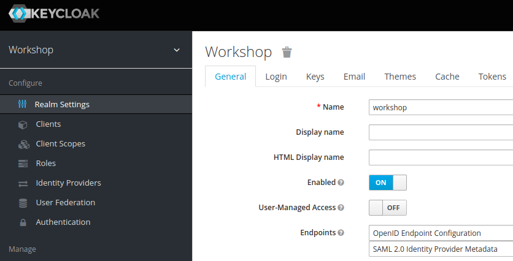

# Preparation: Setting up Keycloak as Identity Provider

In this workshop we will use [Keycloak](https://keycloak.org) by JBoss/RedHat as local identity provider.  
[Keycloak](https://keycloak.org) is [certified for OpenID Connect 1.0](https://openid.net/developers/certified/) and 
implements OAuth 2.0 and OpenID Connect 1.0.

## Setup Keycloak

To setup [Keycloak](https://keycloak.org): 

1. Download the prepared [Keycloak for Workshop](https://tinyurl.com/y3wjzwch) (Using password: _Workshop_).
2. Extract the downloaded zip file __keycloak_workshop.zip__ into a new local directory of your choice 
(this directory will be referenced as __<KEYCLOAK_INSTALL_DIR>__ in next steps)

To startup [Keycloak](https://keycloak.org):

1. Open a terminal and change directory to sub directory __<KEYCLOAK_INSTALL_DIR>/bin__ and start Keycloak using 
the __standalone.sh__(Linux or Mac OS) or __standalone.bat__ (Windows) scripts
2. Wait until keycloak has been started completely - you should see something like this `...(WildFly Core ...) started in 6902ms - Started 580 of 842 services`
3. Now direct your browser to [localhost:8080/auth/admin](http://localhost:8080/auth/admin/)
4. Login into the admin console using __admin/admin__ as credentials

Now, if you see the realm _workshop_ on the left then Keycloak is ready to use it for this workshop

If you want to know more about setting up a Keycloak server for your own projects 
then please consult the [keycloak administration docs](https://www.keycloak.org/docs/latest/server_admin/index.html).